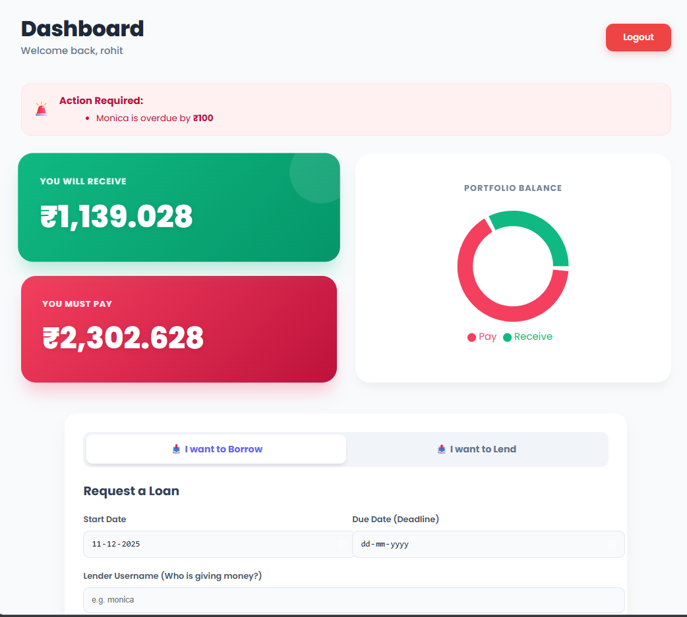

# 💰 Interest Calculator & Fintech Dashboard

A full-stack MERN (MongoDB, Express, React, Node.js) application designed to track loans, investments, and interest calculations. This application features a dual-role system (Lender/Borrower), real-time portfolio visualization, and professional reporting tools.

 
*(Replace this link with a real screenshot of your dashboard later!)*

## 🚀 Key Features

* **🔐 Secure Authentication:** JWT-based Login and Signup with password encryption (Bcrypt).
* **📊 Smart Dashboard:** Interactive charts (Recharts) and gradient cards showing total assets vs. liabilities.
* **🔄 Dual-Role Transaction:** Toggle easily between "Lending Money" and "Borrowing Money" modes.
* **💸 Smart Repayments:** Track partial payments, calculate remaining balances, and celebrate debt-free moments with confetti animations!
* **📄 PDF Reports:** Generate professional transaction history reports instantly.
* **✨ Modern UI/UX:** Built with Glassmorphism design, Framer Motion animations, and the Poppins font family.
* **📱 Evidence Tracking:** Upload screenshots/proofs for every transaction.

## 🛠️ Tech Stack

**Frontend:**
* React.js (Vite)
* Framer Motion (Animations)
* Recharts (Data Visualization)
* jsPDF & AutoTable (Reporting)
* JS-Confetti (Gamification)

**Backend:**
* Node.js & Express.js
* MongoDB & Mongoose (Database)
* JSON Web Token (JWT) (Security)
* Multer (File Handling)

## ⚙️ Installation & Setup

Follow these steps to run the project locally.

### 1. Prerequisites
Make sure you have **Node.js** and **MongoDB** installed on your machine.

### 2. Clone the Repository
```bash
git clone [https://github.com/your-username/interest-calculator.git](https://github.com/your-username/interest-calculator.git)
cd interest-calculator